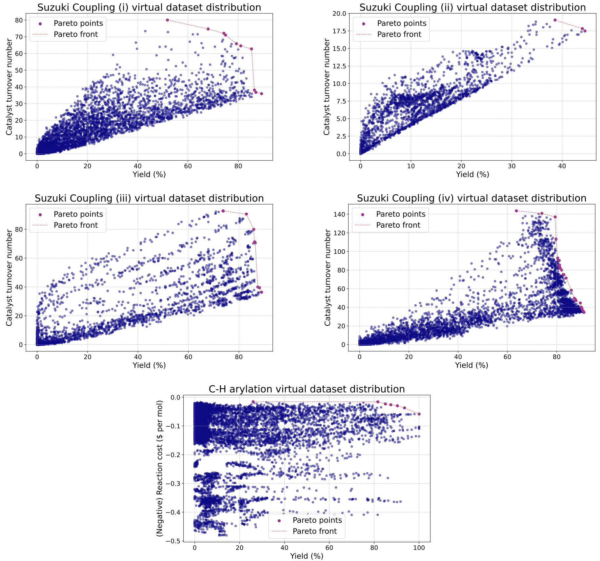

# Virtual benchmark datasets

Virtual (emulated) benchmark datasets used in the manuscript. The C-H arylation virtual dataset was generated from experimental data from EDBO+, and the Suzuki Coupling (i to iv) virtual dataset was generated from Olympus. 

