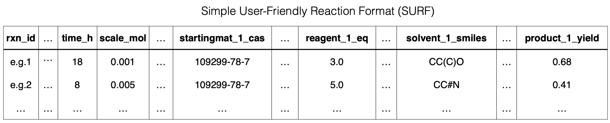

# HTE Experimental data 

Experimental data for the ML HTE optimisation campaign of a nickel-catalysed Suzuki reaction detailed in the manuscript. ML plate suggestions and ML training data used at each iteration are included.

All collected experimental data are available in the Simple User-Friendly Reaction Format (SURF).

